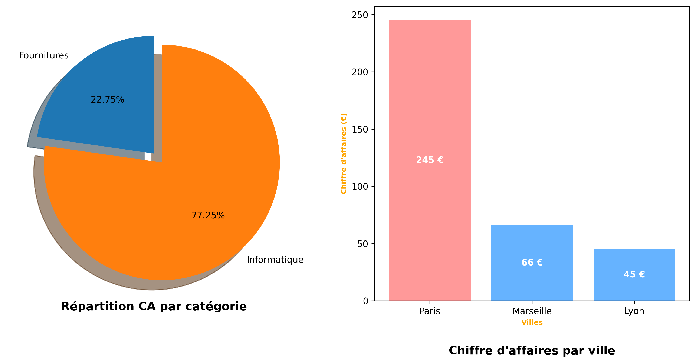

# 📊 Analyse des ventes – Sage Gestion Commerciale

## 🏢 Contexte

Ce projet simule une mission de consulting freelance pour une PME utilisant **Sage Gestion Commerciale**.  
L'objectif est d'analyser les ventes afin de produire un **rapport clair et actionnable** pour le client.

---

## 🎯 Objectifs

- Calculer le **chiffre d’affaires (CA)** total  
- Identifier les **catégories les plus rentables**  
- Identifier les **villes les plus performantes**  
- Générer des **visualisations professionnelles** (camembert, bar chart, dashboard)  
- Fournir un **rapport écrit avec recommandations métier**

---

## 📂 Données utilisées

- Export Sage Gestion Commerciale (`ventes.csv`)  
- Colonnes principales :
  - `produit`  
  - `categorie`  
  - `ville`  
  - `quantite`  
  - `prix`  

- Création d’une nouvelle colonne **chiffre_affaires = quantite × prix**

---

## 🛠️ Méthodologie

1. Lecture et exploration des données avec **pandas**  
2. Agrégation du CA par :
   - Produit
   - Catégorie
   - Ville  
3. Tri des résultats pour identifier les **tops**  
4. Visualisation des données avec **matplotlib** :
   - Camembert pour la répartition du CA par catégorie  
   - Bar chart pour le CA par ville  
   - Dashboard combiné pour la vue globale  
5. Rédaction d’un **rapport PDF** avec analyse et recommandations

---

## 📈 Résultats clés

- Catégorie la plus rentable : **Informatique**  
- Ville générant le plus de CA : **Paris**  
- CA total : 356€  

### 💡 Recommandations

- Consolider la gamme **'Informatique'**, qui représente une part significative du chiffre d'affaires  
- Renforcer les actions commerciales dans la ville de **'Paris'**, zone actuellement la plus rentable  
- Analyser les catégories à faible CA afin d’identifier des leviers d’optimisation (prix, volume, abandon)

---

## 🖼️ Livrables

- **Dashboard et graphiques** (camembert, bar chart, combiné) → `visuals/`  
- **Rapport PDF final** → `raport/rapport_final_ventes.pdf`  
- **Notebook Jupyter** avec code et analyses → `notebooks/analyse_vente.ipynb`  
- Données source → `data/ventes.csv`

---

## 💻 Technologies utilisées

- Python (**pandas**, **matplotlib**, **reportlab**)  
- Word / Google Docs pour la rédaction finale du rapport  
- Export PDF pour livrable client

---

## 🏆 Valeur métier

Ce projet montre la capacité à transformer des données brutes Sage en **informations claires, visualisations professionnelles et recommandations actionnables**, prêt à être livré à un client ou présenté dans un portfolio.

---

## Visualiser le Graphique

---
## 📁 Structure du projet

analyse-ventes-sage/
│
├── data/
│ └── ventes.csv
├── notebooks/
│ └── analyse_ventes.ipynb
├── visuals/
│ ├── dashboard_ca1.png
│ ├── dashboard_ca2.png
│ ├── dashboard_ca3.png
│ └── dashboard_ventes.png
├── reports/
│ └── rapport_final_ventes.pdf
└── README.md
